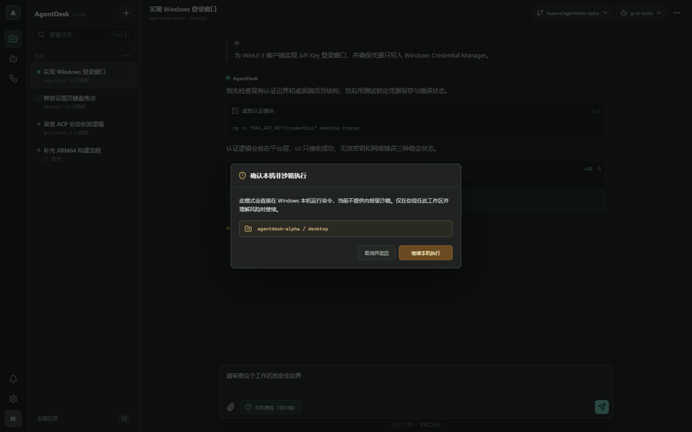

# AgentDesk

[English](README.md) | [简体中文](README.zh-CN.md)

> [!WARNING]
> AgentDesk 是 Alpha 阶段软件，可以读取文件、编辑文件和运行命令。当前桌面界面仅开放**本机兼容模式（非沙箱，`NativeProtected`）**，并会继承当前 Windows 用户的文件与网络权限。**WSL2 严格模式（`WslStrict`）目前有意采用 fail-closed（失败即关闭）策略**，直至能够证明所有子进程都受到网络限制。请只对你信任的工作区使用 AgentDesk。

AgentDesk 是一个由社区独立维护的 Windows 11 桌面客户端，基于 `xai-org/grok-build` 开源运行时的 [`c68e39f`](https://github.com/xai-org/grok-build/commit/c68e39f) 提交构建。AgentDesk 与 xAI、SpaceXAI、OpenAI 或 Codex 均无隶属或合作关系，也未获得这些组织或产品的认可。它实现的是社区自有的本地工作流，不复制，也不声称等价于 Codex 的私有账号、配额、连接器、托管执行或模型服务能力。



## 主要能力

- 使用 .NET 10、WinUI 3 和 WebView2 构建的原生 Windows 11 外壳。
- Rust 智能体运行时作为 ACP/NDJSON stdio sidecar 独立运行，不链接运行时私有 API。
- 简体中文优先的桌面界面，提供英文切换、可调界面字体、可持久化拖拽检查器、工作区选择、任务取消、Plan Mode、图片附件与可搜索会话中心。Web 标签会立即切换，原生字符串在重启后切换。
- 通过 Windows 凭据管理器保存 API 凭据，并从 sidecar 继承的环境变量中移除凭据。
- 支持 xAI 与自定义 OpenAI 兼容 Base URL/模型/backend 设置，包括 Responses API 选择；默认使用 HTTPS，明文 HTTP 必须明确授权风险。
- 提供明确的权限请求、本机执行风险门禁、进程树清理，以及需原生确认的可选“完全访问”；它会自动处理 ACP 工具审批，但不会关闭插件、凭据或 Windows Automation 的独立门禁。
- 使用 Monaco 和 xterm.js 检查更改、终端输出与计划；支持会话分叉、压缩、回退、重命名、导入/导出和可逆本地归档。
- 提供活动会话 Runtime Dashboard，以及 worktree 创建、列表、检查、应用、移除和 GC 流程。代码审查采用两步流程：先生成并编辑审查请求，再显式启动并进入标准提示词与权限链。
- 提供有界工作区文件引用、`AGENTS.md` 编辑器，以及按能力启用的 Memory 浏览器；正文限制为 64 KiB UTF-8，写入和删除必须经过宿主掌握的两阶段确认。
- 提供 MCP Server、Skills、Hooks、Plugins 与受策略约束的 Marketplace 管理；Secret 值不会进入 WebView2 消息。使用远程 Cloud Profile 时，所有可能加载代码的 Plugin/Marketplace 操作都会 fail-closed，且不会信任客户端提供的发布者声明。
- 提供可选 Windows 通知、本地备份/恢复和签名校验的 Portable 更新器。Portable 后台可用更新检查默认关闭，只有用户明确 opt-in 后才会周期运行；应用更新仍需显式操作，MSIX 更新仍需外部手动完成。
- 提供宿主侧实验性 Windows UI Automation 操作面，支持聚焦窗口、调用控件和设置值。设置页已经提供有界控件；每次请求仍受本地/团队策略与“仅允许一次”权限审批约束，输入值不会回显到状态或完成事件。
- 恢复密钥配对包通过原生对话框导入/导出，并实施文件大小限制、reparse/final-path 校验、Windows 设备名拒绝和原子替换。
- 提供可选加密自托管 Cloud 客户端，用于会话同步、设备接力、团队策略、Runner 注册、加密任务加入队列/领取/完成、自动化创建/列表/停用，以及需认证的 SignalR 变更通知；默认始终为 local-only。开发预览 Server 现有 37 项测试，并有独立的真实进程停机备份/恢复/回滚 E2E 作业。
- 定义 x64/ARM64 Portable 与 MSIX CI、签名门禁、SBOM、校验和与上一发布回滚包验证。

## Alpha 状态与安全边界

当前源码树提供本地桌面流程：选择工作区、配置 xAI 或 OpenAI 兼容端点并保存 Key、启动或恢复 ACP 会话、使用执行/计划模式、审查权限、检查更改/输出、管理会话历史并停止任务。它还不是稳定或安全加固版本；只有 workflow 定义也不能证明已发布签名公开安装包。

Alpha 界面默认使用简体中文，并提供英文切换入口。React/WebView2 标签会立即切换；WinUI 资源会在应用下次启动时应用。已有资源与桥接自动化测试，但中文 IME、Narrator、高对比度、纯键盘和缩放仍是发布前人工门禁。

最新本地源码树证据统一记录在[构建与测试](docs/BUILD-AND-TEST.zh-CN.md)中，并会在发布前重新生成。公开源码仓库为 [rkshadow999/AgentDesk](https://github.com/rkshadow999/AgentDesk)。本地验证不代表已经获得签名公开 MSIX、ARM64 真实设备启动、真实 WSL2 环境中可用的 `WslStrict`，或生产 Cloud/Runner 就绪证据。未使用发布证书在本地生成的 MSIX 只是未签名开发产物。

`NativeProtected` 作为协议名称保留以兼容现有实现，界面将其标为**本机兼容模式（非沙箱）**。该模式使用独立的 AgentDesk 应用数据目录，清除继承的凭据环境变量，在桌面宿主中保留权限审批，并在结束时回收 sidecar 进程树。但它仍以当前 Windows 用户权限执行，不能限制文件系统或网络访问。

“完全访问”默认关闭，持久化前必须经过原生确认。开启后，桌面端会为 ACP 引擎工具请求自动选择引擎提供的单次允许选项。这只是减少弹窗的便利能力，不是隔离：命令仍使用当前 Windows 用户权限，可能修改所选工作区以外的文件或访问网络。关闭后会立即恢复逐次审批；插件安装、凭据、恢复操作、明文传输和 Windows Automation 继续使用各自的独立确认。

`WslStrict` 要求引擎在认证或创建会话前证明严格沙箱已经启用，并且子进程网络限制有效。引擎目前无法证明 helper、插件、Hook、PTY 和所有命令启动路径都受到同等限制，因此会报告证明不完整。桌面端会停止 sidecar，不会降级或继续执行。详见[桌面端安全说明](desktop/README.zh-CN.md#执行配置)。

## 已配置的系统

| 组件 | 支持目标 |
| --- | --- |
| 桌面客户端 | Windows 11 x64；已配置 ARM64 项目和 CI，但仍需要成功 CI 与真实设备证据 |
| 本机 sidecar | Windows x64；ARM64 是已配置构建目标，不代表已在本机验证 |
| 随包 WSL payload | 与 Windows 包架构匹配的 Linux x64 或 ARM64；两种架构的严格执行仍受阻断 |
| 源码构建 | PowerShell 7、Git、Node.js 24、`global.json` 固定的 .NET SDK 10.0.302、`rust-toolchain.toml` 固定的 Rust 1.92.0、固定 `protoc` 29.3、带“使用 C++ 的桌面开发”工作负载/MSVC v143 的 Visual Studio 2022 Build Tools，以及 Windows 11 SDK 10.0.26100 |

项目中保留了 Windows 10 构建元数据以兼容框架，但 AgentDesk 社区目前只测试和支持 Windows 11。

## 从源码构建

AgentDesk 不提供上游或官方安装命令。在 AgentDesk 出现已签名 GitHub Release 前，请克隆本仓库并从源码构建桌面客户端：

```powershell
$env:PROTOC = ./scripts/agentdesk/Install-Protoc.ps1 `
  -Version 29.3 `
  -Destination "$env:TEMP/agentdesk-protoc"

Set-Location desktop/web
npm ci
npm test
npm run build
Set-Location ../..

cargo build --locked -p xai-grok-pager-bin --profile release-dist --features release-dist

./scripts/agentdesk/Build-AgentDeskPackage.ps1 `
  -Architecture x64 `
  -Mode Portable `
  -NativeEnginePath ./target/release-dist/xai-grok-pager.exe `
  -OutputRoot ./artifacts/agentdesk
```

准确的打包入口是 [`scripts/agentdesk/Build-AgentDeskPackage.ps1`](scripts/agentdesk/Build-AgentDeskPackage.ps1)。只有在 ARM64 构建主机上才能将 `x64` 替换为 `arm64`，配置本身不能作为 ARM64 验证。使用或分发产物前，请阅读[安装指南](docs/INSTALLATION.zh-CN.md)和[构建与测试](docs/BUILD-AND-TEST.zh-CN.md)。

## 仓库结构

| 路径 | 用途 |
| --- | --- |
| `desktop/src` | WinUI 宿主、共享契约、ACP 客户端与 Windows 平台服务 |
| `desktop/web` | React 工作台与检查器界面 |
| `desktop/tests` | .NET 宿主、引擎、核心与平台测试 |
| `crates/codegen/xai-grok-shell` | 上游 Rust 运行时与 AgentDesk ACP 扩展 |
| `scripts/agentdesk` | 构建、打包、验证与发布脚本 |
| `cloud` | 可选自托管服务器开发预览，由显式启用的桌面 Cloud 客户端使用 |
| `docs` | 安装、架构、威胁模型、构建/测试、路线图、来源、设计与计划 |

继承的 Rust 源码树及其原始文档继续用于运行时开发。AgentDesk 自维护的公开文档均提供中英文版本；继承的上游变更记录、提示词、技能、测试夹具、许可证文本与 Rust 指南保留原始语言，以便持续与上游同步。

## 项目方向

本地工作台、双语切换、图片提示、会话/历史维护、worktree、Runtime Dashboard、扩展管理、通知、备份/恢复、Portable 更新流程、实验性 Windows UI Automation 操作面和可选加密 Cloud 工作流都已接入源码。公开仓库已经建立，但发布证据仍不完整：当前不声称存在正式签名公开包，ARM64 尚未在真实硬件上验证，`WslStrict` 仍受阻断，Portable 后台检查只有在用户明确 opt-in 后才会周期运行且绝不会自动应用更新，Windows UI Automation 不具备隔离或通用 Computer Use 保证，Cloud 服务与 Runner 工作流也尚未完成生产加固。

每项能力状态见证据化[路线图](docs/ROADMAP.zh-CN.md)。上游更新遵循[同步策略](docs/UPSTREAM.zh-CN.md)。

## 文档

- [安装、校验、升级与手动回滚](docs/INSTALLATION.zh-CN.md)
- [桌面/sidecar/数据归属架构](docs/ARCHITECTURE.zh-CN.md)
- [基于仓库证据的威胁模型](docs/AGENTDESK-THREAT-MODEL.zh-CN.md)
- [构建、测试、打包与 CI 证据](docs/BUILD-AND-TEST.zh-CN.md)
- [维护者发布清单](docs/RELEASING.zh-CN.md)
- [交付状态与剩余门禁](docs/ROADMAP.zh-CN.md)

## 社区

欢迎提交 Issue 与范围集中的 Pull Request。参与前请阅读[贡献指南](CONTRIBUTING.zh-CN.md)和[行为准则](CODE_OF_CONDUCT.zh-CN.md)。请按照[安全策略](SECURITY.zh-CN.md)私下报告漏洞；不要为尚未公开的漏洞创建公开 Issue。

## 许可证与来源

AgentDesk 保留了 `xai-org/grok-build` 的完整上游历史；AgentDesk 的初始基线提交为 `c68e39f`。第一方源码继续采用 [Apache License 2.0](LICENSE)。第三方和 vendored 源码继续适用各自许可证。

- [上游来源与同步策略](docs/UPSTREAM.zh-CN.md)
- [全仓第三方声明](THIRD-PARTY-NOTICES)
- [桌面端依赖声明](desktop/THIRD-PARTY-NOTICES.md)
- [第三方源码可获取性说明](desktop/THIRD-PARTY-SOURCE-NOTICE.zh-CN.md)

这些许可证与源码说明不授予任何第三方商标权。AgentDesk 使用独立的项目身份，不会将自身表述为任何上游产品的官方发行版。
