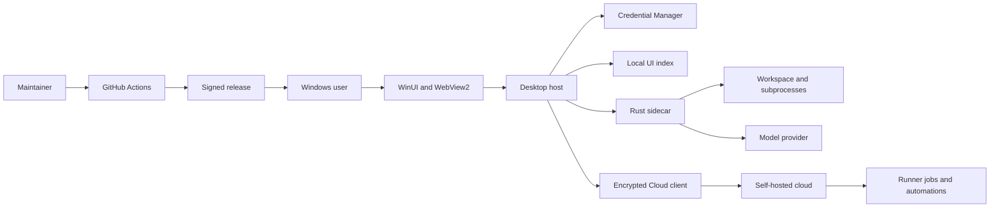

# AgentDesk Threat Model

[English](AGENTDESK-THREAT-MODEL.md) | [简体中文](AGENTDESK-THREAT-MODEL.zh-CN.md)

## Executive summary

AgentDesk's highest risks come from deliberately running an agent with the current Windows user's authority, crossing credential/content boundaries to a model provider, and accepting executable extensions or opt-in encrypted cloud inputs. Strong current controls include fail-closed credential/protocol/signing checks, host-side cloud encryption and rollback detection, hardened recovery-key pairing, and the unavailable strict profile. The largest residual gaps are that native execution is not a sandbox and that the self-hosted Cloud and Runner workflows are developer-preview components rather than production-isolated services.

## Scope and assumptions

In scope are `desktop/`, AgentDesk-facing Rust changes under `crates/codegen/`, `cloud/`, `scripts/agentdesk/`, and `.github/workflows/agentdesk-windows.yml`. Runtime behavior is separated from CI/release behavior. Inherited upstream surfaces not reachable from the desktop configuration, official xAI/OpenAI/Codex services, Windows kernel security, and compromise of the user's Windows administrator account are out of scope.

Assumptions:

- One local Windows user controls the desktop and chooses workspaces; a cloned workspace, prompt, tool output, plugin, Hook, Skill, or MCP server may be malicious.
- The model provider is an external data recipient. HTTPS protects transport only; it does not make the provider trusted with content.
- The optional Cloud remains local-only by default and requires an explicit remote profile. The desktop client, encrypted sync/handoff, recovery-key pairing, Runner/automation workflows, and authenticated SignalR notifications are implemented, while the server remains a developer preview that an operator may expose to the Internet.
- Attackers do not initially possess the Windows account, release signing private key, cloud bootstrap token, or client-side envelope key.
- The user requested autonomous completion and did not provide deployment-specific clarification, so cloud risk is rated for a small multi-device team rather than a public hosted multi-tenant service.

Open questions that would change ranking: whether the Cloud will be multi-tenant and Internet-facing; how recovery keys will be rotated, revoked, recovered after device loss, or escrowed for a production team; what TLS, reverse-proxy, monitoring, and prompt/session retention policy a production deployment will promise; and whether production plugins or Runners will execute code from untrusted publishers.

## System model

### Primary components

- WinUI host and versioned WebView2 bridge: desktop entry point and approval authority (`desktop/src/AgentDesk.App`).
- Core contracts, ACP client, and sidecar process host: validates protocol messages and owns engine generations (`desktop/src/AgentDesk.Core`, `desktop/src/AgentDesk.Engine`).
- Windows storage: Credential Manager for provider/Cloud secrets and SQLite/JSON for UI metadata, Cloud profiles, and sync revisions (`desktop/src/AgentDesk.Platform.Windows`).
- Rust sidecar: sessions, provider calls, filesystem/Git tools, subprocesses, extensions, and inherited plugin/Hook/MCP surfaces (`crates/codegen/xai-grok-shell`, `crates/codegen/xai-grok-tools`).
- Opt-in desktop Cloud client: remote profile coordination, Credential Manager-backed access/recovery secrets, AES-GCM envelopes, rollback detection, pairing, handoff, Runner/automation operations, and SignalR notifications (`desktop/src/AgentDesk.Cloud.Client`, `desktop/src/AgentDesk.App/Cloud`, `desktop/src/AgentDesk.Platform.Windows/Cloud`).
- Optional ASP.NET Core cloud: bearer roles, SQLite records, opaque envelopes, runners, automations, plugin signatures, and SignalR notifications (`cloud/src/AgentDesk.Cloud`).
- Release pipeline: architecture builds, signing, SBOM, checksums, rollback bundle, and GitHub publication (`.github/workflows/agentdesk-windows.yml`, `scripts/agentdesk`).

### Data flows and trust boundaries

- User -> WebView2/WinUI: prompts, workspace paths, provider settings, approvals, and history operations cross a local UI boundary. Typed versioned messages and modal gating validate commands (`desktop/src/AgentDesk.App/Bridge/WebMessageProtocol.cs`).
- WebView2 -> host -> sidecar: UI commands, API key, prompts, session IDs, and decisions cross JSON/NDJSON redirected stdio. The credential extension precedes ACP initialization; size/control-character checks and engine generations constrain input (`desktop/src/AgentDesk.Engine/Acp/AcpEngineClient.cs`).
- Sidecar -> workspace/subprocess: file content, commands, environment, and tool results cross into OS resources. Permission prompts and process-tree cleanup exist, but native execution has the current user's filesystem and network authority (`desktop/src/AgentDesk.Engine/Sidecar`, `crates/codegen/xai-grok-tools/src/computer/local/terminal.rs`).
- Sidecar -> provider: credentials, prompts, tool context, and model output cross HTTP(S). Custom Base URLs are allowed; plaintext HTTP requires explicit opt-in and credentials are bound to an endpoint (`desktop/src/AgentDesk.Core/Providers`, `desktop/src/AgentDesk.Engine/Sidecar/SidecarCommandBuilder.cs`).
- Desktop Cloud client -> self-hosted Cloud: header bearer tokens, team/device/runner identifiers, AES-GCM session/handoff/job/automation ciphertext, policy, revisions, and notifications cross HTTPS/SignalR after explicit remote-profile setup. Access tokens and recovery keys remain in Credential Manager; authenticated data binds scope/team/session or handoff identity and revision; persisted revisions reject rollback. The server applies role policies, validation, rate limiting, opaque storage, and subject revocation, while production TLS operations and Runner isolation remain outside the delivered guarantee (`desktop/src/AgentDesk.Cloud.Client`, `desktop/src/AgentDesk.App/Cloud/AgentDeskCloudDesktopService.cs`, `cloud/src/AgentDesk.Cloud/Program.cs`).
- Maintainer -> GitHub Actions -> user: source, dependencies, PFX secret, binaries, SBOMs, and checksums cross the build/release boundary. Actions are commit-pinned; tag builds require a valid signer and previous-release rollback assets are rehashed (`.github/workflows/agentdesk-windows.yml`, `scripts/agentdesk/Verify-AgentDeskMsixSignature.ps1`).

#### Diagram

## Assets and security objectives

| Asset | Why it matters | Security objective (C/I/A) |
| --- | --- | --- |
| Provider API keys, Cloud tokens, recovery keys, and pairing packages | Theft enables paid API use, cloud control, decryption, device impersonation, or data access | C, I |
| Prompts, source, diffs, terminal output, and session history | May contain proprietary code, personal data, or secrets | C, I |
| Workspace and Git history | Agent writes can corrupt code or plant executable changes | I, A |
| Permission and execution-profile state | Confusion or stale approval can authorize unintended work | I |
| Engine sessions, rewind points, and local index | Needed for recovery and may reveal project metadata | C, I, A |
| Cloud team policy, envelopes, jobs, handoffs, and plugin metadata | Cross-device integrity and isolation depend on them | C, I, A |
| Signing key, workflow, checksums, SBOMs, and release assets | Compromise distributes trusted malicious code | C, I |
| Desktop/sidecar availability | Long output, process leaks, or queue abuse can block work | A |

## Attacker model

### Capabilities

- Supplies a malicious repository, prompt content, file name, tool output, plugin, Hook, Skill, MCP server, or provider response.
- Observes or alters plaintext provider traffic when the user explicitly enables HTTP.
- Sends unauthenticated or stolen-token requests to an Internet-exposed cloud deployment and races runner leases or automation schedules.
- Operates or compromises a configured Cloud endpoint, supplies stale or malformed encrypted records, or obtains a pairing package/passphrase through a separate disclosure.
- Submits a dependency update or source contribution and attempts CI/release supply-chain compromise.
- Runs another unprivileged process as the same Windows user after separate local compromise.

### Non-capabilities

- Cannot bypass Windows account isolation, decrypt TLS, forge a valid publisher signature, or read Credential Manager solely by opening a repository.
- Cannot decrypt correctly implemented client-side cloud envelopes from the server database alone.
- Cannot make `WslStrict` silently downgrade without another validation defect; current health failure stops startup.
- Does not control GitHub, the signing certificate, Windows administrator, or the model provider unless a threat explicitly assumes that compromise.

## Entry points and attack surfaces

| Surface | How reached | Trust boundary | Notes | Evidence |
| --- | --- | --- | --- | --- |
| Web host-message bridge | Local UI actions or compromised packaged Web asset | WebView2 -> WinUI | Versioned command parsing and modal isolation | `desktop/src/AgentDesk.App/Bridge/WebMessageProtocol.cs` |
| ACP/NDJSON parser | Sidecar stdout or desktop requests | Host <-> sidecar | Extension size/schema validation; stale generations rejected | `desktop/src/AgentDesk.Engine/Acp/AcpEngineClient.cs` |
| Provider settings | Settings UI and stored JSON | User -> host -> sidecar/network | Endpoint-bound key; explicit HTTP opt-in | `desktop/src/AgentDesk.Core/Providers/ProviderProfile.cs` |
| Workspace tools and terminal | Agent tool calls after user approval | Sidecar -> OS/workspace | Native mode is not confined | `crates/codegen/xai-grok-tools/src/computer/local/terminal.rs` |
| Sessions/history | Search, load, fork, compact, rewind, archive | UI -> host -> engine/storage | Engine content and UI index have different owners | `desktop/src/AgentDesk.Engine/Acp/AcpEngineClient.cs` |
| Runtime extensions | Commands, tasks, subagents, plugins/Hooks/MCP | Engine configuration -> executable behavior | Typed discovery is not code safety | `desktop/src/AgentDesk.Core/Engine/RuntimeCommands.cs`, `desktop/src/AgentDesk.Core/Engine/ExtensionManagement.cs` |
| Desktop Cloud profile and pairing | Explicit remote setup, native token/passphrase prompts, pairing import/export, sync/handoff/Runner/automation controls | User/desktop -> Cloud client -> remote server/filesystem | Local-only default; Credential Manager secrets; AES-GCM AAD; revision rollback checks; bounded native pairing files | `desktop/src/AgentDesk.App/Cloud`, `desktop/src/AgentDesk.Cloud.Client` |
| Cloud HTTP/SignalR | Network requests with header bearer token | Internet/client -> cloud | Role policies, validation, fixed-window rate limiting; query tokens rejected | `cloud/src/AgentDesk.Cloud/Program.cs` |
| Plugin publication | Admin publisher registration and signed payload | Publisher/admin -> cloud clients | Signature verifies origin, not safety | `cloud/src/AgentDesk.Cloud/PluginSignatureVerifier.cs` |
| Package/release scripts | Push, pull request, or tag | Contributor/maintainer -> CI -> user | Pinned actions, signing gate, SBOM/checksums | `.github/workflows/agentdesk-windows.yml` |

## Top abuse paths

1. A repository embeds persuasive instructions -> the model proposes a broad command -> the user approves it in native mode -> the command reads or modifies any file reachable by that Windows user -> source or credentials are exfiltrated.
2. A user enables plaintext HTTP for a custom provider -> a network attacker replaces model/tool instructions and captures the API key -> malicious output drives further approved execution.
3. A malicious or compromised sidecar emits crafted/stale notifications -> the host associates them with the wrong task or approval -> unintended history or permission state is shown unless generation and schema checks hold.
4. A trusted-looking plugin/Hook/MCP package is installed -> its signature or metadata passes authenticity checks -> executable code runs with sidecar/native authority -> workspace and user data are compromised.
5. A cloud device/service token leaks -> the attacker calls role-allowed endpoints -> encrypted records are deleted/replaced, jobs are claimed, or metadata is enumerated -> cross-device availability and integrity fail.
6. A recovery key or pairing passphrase is exposed, or a client cryptography/revision regression weakens the authenticated binding -> an attacker decrypts, substitutes, replays, or rolls back synced sessions, handoffs, Runner tasks, or automations -> cross-device confidentiality and integrity fail despite opaque server storage.
7. A dependency or workflow contribution reaches a tag build -> malicious code executes during build or alters packaged files -> users install a correctly signed malicious release unless review and provenance gates detect it.
8. An attacker floods terminal/session/cloud inputs -> memory, SQLite, logs, queues, or WebView rendering are exhausted -> tasks and cloud coordination become unavailable.

## Threat model table

| Threat ID | Threat source | Prerequisites | Threat action | Impact | Impacted assets | Existing controls (evidence) | Gaps | Recommended mitigations | Detection ideas | Likelihood | Impact severity | Priority |
| --- | --- | --- | --- | --- | --- | --- | --- | --- | --- | --- | --- | --- |
| TM-001 | Malicious workspace/model output | User opens an untrusted project and approves native execution | Executes commands outside the workspace or sends readable data over the network | User-level data theft or destructive modification | Keys, source, workspace, sessions | Native risk gate, permission decisions, process-tree cleanup (`AgentDeskHostController`, `SidecarProcessHost`) | No filesystem/network confinement; approval can be socially engineered | Keep unknown workspaces blocked until a verifiable isolated runner exists; show normalized command/cwd/network intent; scope approvals to one operation | Record decision type and command digest without prompt/file bodies; alert on workspace escape paths | High | High | high |
| TM-002 | Network attacker/malicious provider | Custom plaintext HTTP is explicitly enabled, or provider is untrusted | Captures key/content or injects responses/tool instructions | Credential theft and code execution chain | API key, prompts, source | HTTP opt-in and endpoint-bound credentials (`ProviderProfile`, provider settings tests) | Opt-in cannot protect plaintext; HTTPS provider still sees content | Keep HTTP off by default; add certificate/publisher guidance and per-provider content disclosure; support local proxy pinning only when maintainable | Surface insecure transport continuously; count blocked insecure sends without logging URLs containing secrets | Medium | High | high |
| TM-003 | Compromised/malformed sidecar or Web asset | Attacker controls IPC input or packaged content | Confuses sessions, stale generations, permissions, or modal state | Wrong-task action or approval | Permission state, workspace, history | Versioned messages, schema/size checks, serialized generation isolation (`AcpEngineClient`, `WebMessageProtocol`) | No cryptographic IPC peer identity; host launches local binary by path | Hash/verify bundled engine at startup; keep exhaustive command allowlists and generation tests; isolate WebView data directories | Emit sanitized protocol violation counters and engine hash/version in diagnostics | Medium | High | high |
| TM-004 | Malicious plugin/Hook/MCP/Skill | User or policy enables executable extension | Runs code or manipulates agent instructions under native authority | Data theft, persistence, source compromise | Workspace, keys, provider content | Runtime discovery metadata, cloud publisher signatures, confirmation for code-loading mutations, and remote-profile fail-closed Plugin/Marketplace policy (`RuntimeCommands.cs`, `AgentDeskCloudPolicyGate.cs`, `PluginSignatureVerifier.cs`) | Signature is provenance only; no isolated extension execution or complete host-verified registry trust UX | Treat all executable extensions as code; display source/path/publisher; require per-workspace allowlists; execute only in an attested isolated Runner when available | Audit extension enable/disable and publisher key changes; flag unsigned or path-changing updates | Medium | High | high |
| TM-005 | Remote attacker with stolen cloud token | Cloud is exposed and bearer token leaks | Uses device/service role to read metadata, replace envelopes, claim jobs, or target handoffs | Cross-device integrity/availability loss | Cloud records, policy, jobs | Hashed tokens, fixed-time comparison, RBAC, rate limits, bounded bootstrap-token overlap, idempotent subject revocation, and query-token rejection (`CloudAuthenticationHandler`, `CloudFeatureEndpoints`, `cloud/OPERATIONS.md`) | Issued tokens have no automatic expiry/rotation and production audit/alerting remains incomplete | Add expiry and rotation UX, narrower per-device scopes, replay-resistant audit events, deployment key management, and rehearsed emergency revocation | Alert on token use from new network/agent, repeated conflicts, revocations, and unusual claim rates | Medium | High | high |
| TM-006 | Cloud operator/database attacker, stolen recovery material, or flawed client crypto | A user explicitly enables a remote profile and syncs or pairs sensitive data | Exploits key/passphrase disclosure, nonce/AAD regression, rollback/replay handling, or metadata substitution | Session disclosure or undetected cross-device replacement | Synced sessions, handoffs, Runner tasks/results, automations | AES-256-GCM with random nonces and identity/revision AAD, Credential Manager-backed recovery keys, passphrase-protected pairing, monotonic revision storage/rollback rejection, opaque server persistence, and real-Kestrel plaintext-at-rest checks (`AesGcmEnvelopeCodec`, `CloudSyncCoordinator`, `CredentialRecoveryKeyStore`, `RealCloudClientIntegrationTests`) | Recovery-key rotation/revocation, lost-device recovery, packaged multi-device testing, production TLS/monitoring, and external cryptographic review remain incomplete | Add versioned key IDs and rotation/revocation, recovery after device loss, multi-device rollback/replay tests, production TLS validation, and independent cryptographic review before team production use | Monitor revision conflicts, pairing/recovery operations, impossible device counters, and repeated authentication failures without logging plaintext or ciphertext | Medium | High | high |
| TM-007 | Dependency/contributor/CI attacker | Malicious change reaches trusted tag workflow | Alters build inputs or release assets before signing/publication | Signed supply-chain compromise | Signing identity, binaries, users | Commit-pinned Actions, tag signing fail-closed, SBOM/checksums, source revision, rollback verification (`agentdesk-windows.yml`) | Hosted runner/dependency install executes third-party code; no published transparency attestation yet | Use protected environments and two-person tag approval; keyless provenance/attestations; verify source-to-artifact revision; minimize PFX exposure | Monitor workflow/release changes, signer identity, artifact attestations, and unexpected dependency deltas | Low | High | high |
| TM-008 | Malicious output/remote client | Can stream large output or send repeated valid requests | Exhausts WebView, host memory, SQLite, runner queue, or cloud rate window | Task or service denial of service | Availability, unsaved work | Message/catalog bounds and cloud ciphertext/rate limits (`AcpEngineClient`, `CloudOptions`, `Program.cs`) | End-to-end terminal/session performance budgets and per-team quotas are incomplete | Add bounded ring buffers, pagination/backpressure, per-team/job quotas, cancellation stress tests, and 10k-session/100k-line benchmarks | Track dropped/truncated events, queue depth, request rejection, memory and restart counts | Medium | Medium | medium |
| TM-009 | Same-user local process or stolen profile | Attacker can read the user's local profile | Reads UI index/settings or manipulates engine session files | Project metadata leak or history corruption | Session metadata, settings, transcripts | API key is separated into Credential Manager; SQLite is metadata-only (`SqliteSessionIndexStore`) | Same-user storage is not an isolation boundary; transcript paths/ACLs and secure deletion are not guaranteed | Document retention; validate paths; add backups/migrations; minimize titles/paths in index; never copy secrets into logs | Detect database migration failures and unexpected session path changes | Medium | Medium | medium |
| TM-010 | Sandbox regression | Strict profile is selected with incomplete enforcement | Attempts silent downgrade or false attestation | User trusts an ineffective sandbox | Workspace and user files | Structured health attestation and fail-closed startup (`AcpEngineClient`, `agentdesk/v1/health`) | Full helper/plugin/PTY network coverage is not implemented | Keep profile unavailable; add adversarial process-escape tests and dedicated WSL distribution before enabling | CI must fail if enforcement test skips or health fields regress | Low | High | medium |

## Criticality calibration

- **Critical:** unauthenticated remote code execution in a default cloud deployment; release signing key theft with active malicious publication; cross-tenant plaintext session disclosure at hosted scale.
- **High:** native command abuse causing user-level exfiltration; bearer auth/authorization bypass; signed extension or workflow compromise; provider credential theft.
- **Medium:** bounded service denial of service; same-user metadata disclosure; strict-mode regression that remains blocked by the current fail-closed gate.
- **Low:** low-sensitivity version/health disclosure; noisy invalid requests stopped by authentication/rate limits; issues requiring prior Windows administrator control with no added capability.

Priority assumes Alpha users understand native-mode warnings and the cloud is not yet a public multi-tenant service. Public hosting or silent extension installation raises TM-004 through TM-006 by at least one level.

## Focus paths for security review

| Path | Why it matters | Related Threat IDs |
| --- | --- | --- |
| `desktop/src/AgentDesk.App/Bridge/AgentDeskHostController.cs` | Approval, session generation, and UI command authority converge here | TM-001, TM-003 |
| `desktop/src/AgentDesk.App/Bridge/WebMessageProtocol.cs` | Parses attacker-influenced WebView commands | TM-003, TM-008 |
| `desktop/src/AgentDesk.Engine/Acp/AcpEngineClient.cs` | Main IPC schema, capability, and stale-event boundary | TM-003, TM-008, TM-010 |
| `desktop/src/AgentDesk.Engine/Sidecar/SidecarCommandBuilder.cs` | Builds native/WSL command and environment | TM-001, TM-002, TM-010 |
| `desktop/src/AgentDesk.Engine/Sidecar/SidecarProcessHost.cs` | Owns process lifetime and strict fail-closed behavior | TM-001, TM-010 |
| `desktop/src/AgentDesk.Platform.Windows/Credentials` | Persists provider credentials, Cloud access tokens, and recovery keys | TM-002, TM-005, TM-006, TM-009 |
| `desktop/src/AgentDesk.Platform.Windows/Sessions/SqliteSessionIndexStore.cs` | Holds searchable project metadata and archive state | TM-008, TM-009 |
| `desktop/src/AgentDesk.Platform.Windows/Cloud/SqliteCloudSyncMetadataStore.cs` | Persists server-scoped revisions used to reject rollback | TM-006, TM-009 |
| `desktop/src/AgentDesk.Cloud.Client/AesGcmEnvelopeCodec.cs` | Defines nonce, key, and authenticated-metadata binding for synced and handoff ciphertext | TM-006 |
| `desktop/src/AgentDesk.Cloud.Client/CloudSyncCoordinator.cs` | Enforces revisions, rollback rejection, encryption/decryption, and engine session import/export | TM-005, TM-006 |
| `desktop/src/AgentDesk.Cloud.Client/CredentialRecoveryKeyStore.cs` | Owns recovery-key generation, Credential Manager storage, and pairing import/export | TM-006 |
| `desktop/src/AgentDesk.App/Cloud/AgentDeskCloudDesktopService.cs` | Connects profiles, tokens, sync, handoff, Runner, automation, and SignalR behavior | TM-004, TM-005, TM-006 |
| `desktop/src/AgentDesk.App/Cloud/PairingPackageFileStore.cs` | Enforces bounded, final-path-checked, atomic pairing-file access | TM-006, TM-009 |
| `crates/codegen/xai-grok-shell/src/extensions/agentdesk.rs` | Credential/health capability server boundary | TM-002, TM-003, TM-010 |
| `crates/codegen/xai-grok-tools/src/computer/local/terminal.rs` | Launches commands with user authority | TM-001, TM-004 |
| `cloud/src/AgentDesk.Cloud/CloudAuthenticationHandler.cs` | Bootstrap and issued-token authentication | TM-005 |
| `cloud/src/AgentDesk.Cloud/CloudFeatureEndpoints.cs` | Policy, tokens, handoffs, plugins, and automations | TM-004, TM-005, TM-006 |
| `cloud/src/AgentDesk.Cloud/CloudStore.cs` | Tenant scoping, revisions, leases, and persistent metadata | TM-005, TM-006, TM-008 |
| `cloud/src/AgentDesk.Cloud/PluginSignatureVerifier.cs` | Publisher signature validation choke point | TM-004 |
| `.github/workflows/agentdesk-windows.yml` | Builds and publishes trusted binaries | TM-007 |
| `scripts/agentdesk/New-AgentDeskRollbackBundle.ps1` | Repackages previous trusted assets and validates hashes | TM-007 |

## Notes on use

- Covered entry points: local Web/host bridge, ACP stdio, provider configuration/network, workspace execution, session/runtime extensions, desktop Cloud profiles/pairing, cloud HTTP/SignalR, and CI/release.
- Every identified trust boundary appears in at least one threat, and runtime risks are separated from build/release risks.
- Assumptions and unanswered deployment questions are explicit. `WslStrict` remains blocked; re-evaluate the current opt-in Cloud path before public hosting or production team use, and again before production Runner execution, unattended device push, automatic update application, or broad executable-plugin distribution.
- This model describes architecture and residual risk; it is not a claim that a penetration test or complete upstream audit has been performed.
