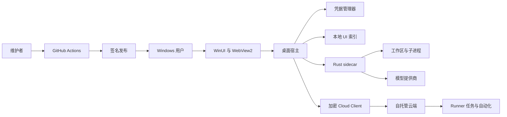

# AgentDesk 威胁模型

[English](AGENTDESK-THREAT-MODEL.md) | [简体中文](AGENTDESK-THREAT-MODEL.zh-CN.md)

## 执行摘要

AgentDesk 的最高风险来自三个方面：有意让智能体使用当前 Windows 用户权限执行；把凭据和内容发送到模型提供商；接收可执行扩展或显式启用的加密云端输入。当前较强控制包括凭据/协议/签名 fail-closed、宿主侧云端加密与回滚检测、加固的恢复密钥配对，以及不可用的严格配置。最大残余缺口是本机执行不是沙箱，而且自托管 Cloud 与 Runner 工作流仍是开发预览，不是具备生产隔离保证的服务。

## 范围与假设

范围包括 `desktop/`、`crates/codegen/` 下 AgentDesk 接入的 Rust 更改、`cloud/`、`scripts/agentdesk/` 和 `.github/workflows/agentdesk-windows.yml`，并区分运行时与 CI/发布行为。未被桌面配置触达的继承上游表面、xAI/OpenAI/Codex 官方服务、Windows 内核安全，以及用户 Windows 管理员账号已失陷的情况不在范围内。

假设如下：

- 单一 Windows 本地用户控制桌面端并选择工作区；克隆的工作区、提示词内容、工具输出、插件、Hook、Skill 或 MCP 服务器都可能恶意。
- 模型提供商是外部数据接收方。HTTPS 只保护传输，不代表提供商可以无条件信任。
- 可选 Cloud 默认保持 local-only，只有保存显式远程 Profile 后才会启用。桌面客户端、加密同步/handoff、恢复密钥配对、Runner/自动化工作流与需认证 SignalR 通知均已实现，但 Server 仍是开发预览，运营者部署后可能暴露到互联网。
- 攻击者初始不持有 Windows 账号、发布签名私钥、云端 bootstrap token 或客户端 envelope 密钥。
- 用户要求自主完成且未提供部署细节，因此云端按小型多设备团队评级，而不是公共托管多租户服务。

可能改变评级的公开问题包括：Cloud 是否多租户并面向公网；生产团队如何轮换/撤销恢复密钥、处理设备丢失后的恢复或密钥托管；生产部署承诺怎样的 TLS、反向代理、监控和提示词/会话保留策略；生产插件或 Runner 是否会运行不受信发布者的代码。

## 系统模型

### 主要组件

- WinUI 宿主与版本化 WebView2 桥：桌面入口和审批权威（`desktop/src/AgentDesk.App`）。
- 核心契约、ACP 客户端和 sidecar 进程宿主：验证协议消息并管理引擎 generation（`desktop/src/AgentDesk.Core`、`desktop/src/AgentDesk.Engine`）。
- Windows 存储：Credential Manager 保存 Provider/Cloud Secret，SQLite/JSON 保存 UI 元数据、Cloud Profile 与同步 revision（`desktop/src/AgentDesk.Platform.Windows`）。
- Rust sidecar：会话、提供商调用、文件/Git 工具、子进程、扩展和继承的插件/Hook/MCP 表面（`crates/codegen/xai-grok-shell`、`crates/codegen/xai-grok-tools`）。
- 可选桌面 Cloud Client：远程 Profile 协调、Credential Manager 访问/恢复 Secret、AES-GCM envelope、回滚检测、配对、handoff、Runner/自动化操作和 SignalR 通知（`desktop/src/AgentDesk.Cloud.Client`、`desktop/src/AgentDesk.App/Cloud`、`desktop/src/AgentDesk.Platform.Windows/Cloud`）。
- 可选 ASP.NET Core 云端：Bearer 角色、SQLite 记录、不透明 envelope、Runner、自动化、插件签名和 SignalR 通知（`cloud/src/AgentDesk.Cloud`）。
- 发布流水线：架构构建、签名、SBOM、校验和、回滚包和 GitHub 发布（`.github/workflows/agentdesk-windows.yml`、`scripts/agentdesk`）。

### 数据流与信任边界

- 用户 -> WebView2/WinUI：提示词、工作区路径、提供商设置、审批和历史操作跨越本地 UI 边界。类型化版本消息和 modal gate 验证命令（`desktop/src/AgentDesk.App/Bridge/WebMessageProtocol.cs`）。
- WebView2 -> 宿主 -> sidecar：UI 命令、API Key、提示词、session ID 和决定跨越 JSON/NDJSON 重定向 stdio。凭据扩展先于 ACP 初始化；大小/控制字符检查和引擎 generation 限制输入（`desktop/src/AgentDesk.Engine/Acp/AcpEngineClient.cs`）。
- sidecar -> 工作区/子进程：文件正文、命令、环境和工具结果进入 OS 资源。系统具有权限提示和进程树清理，但本机执行拥有当前用户的文件与网络权限（`desktop/src/AgentDesk.Engine/Sidecar`、`crates/codegen/xai-grok-tools/src/computer/local/terminal.rs`）。
- sidecar -> 提供商：凭据、提示词、工具上下文和模型输出通过 HTTP(S) 传输。系统允许自定义 Base URL；明文 HTTP 需要明确授权，凭据与端点绑定（`desktop/src/AgentDesk.Core/Providers`、`desktop/src/AgentDesk.Engine/Sidecar/SidecarCommandBuilder.cs`）。
- 桌面 Cloud Client -> 自托管 Cloud：显式设置远程 Profile 后，Header Bearer Token、团队/设备/Runner 标识、AES-GCM 会话/handoff/任务/自动化密文、策略、revision 和通知跨越 HTTPS/SignalR。访问 Token 与恢复密钥保留在 Credential Manager；AAD 绑定 scope/team/session 或 handoff 身份与 revision，持久化 revision 用于拒绝回滚。Server 提供角色策略、验证、限流、不透明存储和 subject 撤销，但生产 TLS 运维与 Runner 隔离不属于已交付保证（`desktop/src/AgentDesk.Cloud.Client`、`desktop/src/AgentDesk.App/Cloud/AgentDeskCloudDesktopService.cs`、`cloud/src/AgentDesk.Cloud/Program.cs`）。
- 维护者 -> GitHub Actions -> 用户：源码、依赖、PFX secret、二进制、SBOM 和校验和跨越构建/发布边界。Action 固定到提交；tag 要求有效签名者，上一发布回滚资产会重新校验哈希（`.github/workflows/agentdesk-windows.yml`、`scripts/agentdesk/Verify-AgentDeskMsixSignature.ps1`）。

#### 图示

## 资产与安全目标

| 资产 | 重要性 | 安全目标（C/I/A） |
| --- | --- | --- |
| 提供商 API Key、Cloud Token、恢复密钥与配对包 | 泄露会导致付费 API 滥用、云端控制、解密、设备冒充或数据访问 | C、I |
| 提示词、源码、diff、终端输出和会话历史 | 可能包含专有代码、个人数据或密钥 | C、I |
| 工作区与 Git 历史 | 智能体写入可能破坏代码或植入可执行改动 | I、A |
| 权限与执行配置状态 | 混淆或旧审批可能授权非预期工作 | I |
| 引擎会话、回退点与本地索引 | 用于恢复，也可能泄露项目元数据 | C、I、A |
| 云端团队策略、envelope、任务、handoff 和插件元数据 | 跨设备完整性与隔离依赖这些数据 | C、I、A |
| 签名密钥、workflow、校验和、SBOM 与发布资产 | 失陷会向用户分发受信恶意代码 | C、I |
| 桌面端/sidecar 可用性 | 超长输出、进程泄漏或队列滥用会阻塞工作 | A |

## 攻击者模型

### 能力

- 提供恶意仓库、提示词内容、文件名、工具输出、插件、Hook、Skill、MCP 服务器或模型响应。
- 用户明确开启 HTTP 时观察或修改明文提供商流量。
- 向面向公网的云端发送未认证或使用被盗 Token 的请求，并竞争 Runner lease 或自动化调度。
- 控制或攻陷已配置的 Cloud 端点，提供旧版/畸形加密记录，或通过独立泄露获得配对包/口令。
- 提交依赖更新或源码贡献，尝试破坏 CI/发布供应链。
- 在另一次本地入侵后，以同一 Windows 普通用户运行其他进程。

### 默认不具备的能力

- 仅通过打开仓库，不能绕过 Windows 账号隔离、解密 TLS、伪造有效 Publisher 签名或读取凭据管理器。
- 仅获得服务器数据库时，不能解密正确实现的客户端云端 envelope。
- 没有其他验证缺陷时，不能让 `WslStrict` 静默降级；当前 health 失败会停止启动。
- 除非某项威胁明确假设，否则不控制 GitHub、签名证书、Windows 管理员或模型提供商。

## 入口与攻击面

| 表面 | 到达方式 | 信任边界 | 说明 | 证据 |
| --- | --- | --- | --- | --- |
| Web 宿主消息桥 | 本地 UI 操作或受损打包 Web 资产 | WebView2 -> WinUI | 版本化命令解析与 modal 隔离 | `desktop/src/AgentDesk.App/Bridge/WebMessageProtocol.cs` |
| ACP/NDJSON 解析器 | sidecar stdout 或桌面请求 | 宿主 <-> sidecar | 扩展大小/Schema 验证；拒绝旧 generation | `desktop/src/AgentDesk.Engine/Acp/AcpEngineClient.cs` |
| 提供商设置 | 设置 UI 与持久化 JSON | 用户 -> 宿主 -> sidecar/网络 | Key 与端点绑定；HTTP 明确授权 | `desktop/src/AgentDesk.Core/Providers/ProviderProfile.cs` |
| 工作区工具与终端 | 用户审批后的智能体工具调用 | sidecar -> OS/工作区 | 本机模式不受限制 | `crates/codegen/xai-grok-tools/src/computer/local/terminal.rs` |
| 会话与历史 | 搜索、加载、分叉、压缩、回退、归档 | UI -> 宿主 -> 引擎/存储 | 引擎正文与 UI 索引归属不同 | `desktop/src/AgentDesk.Engine/Acp/AcpEngineClient.cs` |
| 运行时扩展 | 命令、任务、subagent、插件/Hook/MCP | 引擎配置 -> 可执行行为 | 类型化发现不代表代码安全 | `desktop/src/AgentDesk.Core/Engine/RuntimeCommands.cs`、`desktop/src/AgentDesk.Core/Engine/ExtensionManagement.cs` |
| 桌面 Cloud Profile 与配对 | 显式远程设置、原生 Token/口令输入、配对导入/导出、同步/handoff/Runner/自动化控件 | 用户/桌面 -> Cloud Client -> 远程 Server/文件系统 | 默认 local-only；Credential Manager Secret；AES-GCM AAD；revision 回滚检查；有界原生配对文件 | `desktop/src/AgentDesk.App/Cloud`、`desktop/src/AgentDesk.Cloud.Client` |
| 云端 HTTP/SignalR | 带 Header Bearer Token 的网络请求 | 互联网/客户端 -> 云端 | 角色策略、验证、固定窗口限流；拒绝 query Token | `cloud/src/AgentDesk.Cloud/Program.cs` |
| 插件发布 | 管理员登记发布者与签名 payload | 发布者/管理员 -> 云客户端 | 签名证明来源，不证明安全 | `cloud/src/AgentDesk.Cloud/PluginSignatureVerifier.cs` |
| 打包/发布脚本 | Push、Pull Request 或 tag | 贡献者/维护者 -> CI -> 用户 | 固定 Action、签名门禁、SBOM/校验和 | `.github/workflows/agentdesk-windows.yml` |

## 主要滥用路径

1. 仓库包含诱导性指令 -> 模型提出宽泛命令 -> 用户在本机模式批准 -> 命令读取或修改该 Windows 用户可访问的任意文件 -> 源码或凭据被外传。
2. 用户为自定义提供商开启 HTTP -> 网络攻击者替换模型/工具指令并捕获 API Key -> 恶意输出继续驱动已审批执行。
3. 恶意或受损 sidecar 发送构造或旧通知 -> 宿主把消息关联到错误任务或审批 -> generation/Schema 检查失效时显示或执行错误历史与权限状态。
4. 安装看似可信的插件/Hook/MCP -> 签名或元数据通过真实性检查 -> 可执行代码以 sidecar/本机权限运行 -> 工作区和用户数据失陷。
5. 云端 device/service Token 泄露 -> 攻击者调用角色允许的端点 -> 加密记录被替换、任务被领取或元数据被枚举 -> 跨设备完整性与可用性失效。
6. 恢复密钥或配对口令泄露，或客户端密码学/revision 回归削弱认证绑定 -> 攻击者解密、替换、重放或回滚同步会话、handoff、Runner 任务或自动化 -> 即使 Server 只存不透明密文，跨设备机密性与完整性仍会失效。
7. 依赖或 workflow 更改进入 tag 构建 -> 恶意代码在构建中执行或修改打包文件 -> 审查和来源门禁未发现时，用户安装正确签名的恶意发布。
8. 攻击者灌入终端/会话/云端输入 -> 内存、SQLite、日志、队列或 WebView 渲染耗尽 -> 任务与云协调不可用。

## 威胁模型表

| Threat ID | 威胁来源 | 前置条件 | 威胁行为 | 影响 | 受影响资产 | 现有控制（证据） | 缺口 | 建议缓解 | 检测思路 | 可能性 | 影响级别 | 优先级 |
| --- | --- | --- | --- | --- | --- | --- | --- | --- | --- | --- | --- | --- |
| TM-001 | 恶意工作区/模型输出 | 用户打开不可信项目并批准本机执行 | 在工作区外执行命令，或通过网络发送可读数据 | 用户级数据泄露或破坏 | Key、源码、工作区、会话 | 本机风险门禁、权限决定、进程树清理（`AgentDeskHostController`、`SidecarProcessHost`） | 无文件/网络限制；审批可被社会工程诱导 | 在可验证隔离 Runner 出现前保持陌生工作区受阻；展示规范化命令/cwd/网络意图；审批只覆盖一次操作 | 记录决定类型和命令摘要但不记录提示词/文件正文；对逃离工作区路径告警 | 高 | 高 | high |
| TM-002 | 网络攻击者/恶意提供商 | 明确启用自定义 HTTP，或提供商本身不可信 | 捕获 Key/内容，或注入响应和工具指令 | 凭据泄露与代码执行链 | API Key、提示词、源码 | HTTP 明确授权与端点绑定凭据（`ProviderProfile`、提供商设置测试） | 授权无法保护明文；HTTPS 提供商仍能看到内容 | 默认关闭 HTTP；增加提供商数据披露；只在可维护时支持本地代理 pinning | 持续显示不安全传输；统计被阻断发送且不记录含密钥 URL | 中 | 高 | high |
| TM-003 | 受损/畸形 sidecar 或 Web 资产 | 攻击者控制 IPC 输入或打包内容 | 混淆会话、旧 generation、权限或 modal 状态 | 对错误任务执行或审批 | 权限状态、工作区、历史 | 版本消息、Schema/大小检查、串行化 generation 隔离（`AcpEngineClient`、`WebMessageProtocol`） | IPC peer 无密码学身份；宿主按路径启动本地二进制 | 启动时哈希/验证随包引擎；保持完整命令 allowlist 与 generation 测试；隔离 WebView 数据目录 | 输出脱敏协议违规计数和引擎 hash/version | 中 | 高 | high |
| TM-004 | 恶意插件/Hook/MCP/Skill | 用户或策略启用可执行扩展 | 以本机权限执行代码或操控智能体指令 | 数据泄露、持久化、源码失陷 | 工作区、Key、提供商内容 | 运行时发现元数据、云发布者签名、代码加载修改确认，以及远程 Profile 下 fail-closed 的 Plugin/Marketplace 策略（`RuntimeCommands.cs`、`AgentDeskCloudPolicyGate.cs`、`PluginSignatureVerifier.cs`） | 签名只证明来源；尚无隔离扩展执行或完整的宿主验证 registry 信任 UX | 把所有可执行扩展视为代码；展示来源/路径/发布者；按工作区 allowlist；未来只在有证明的隔离 Runner 中执行 | 审计启停和发布者密钥变化；标记未签名或路径变化更新 | 中 | 高 | high |
| TM-005 | 持有被盗云 Token 的远程攻击者 | 云端暴露且 Bearer Token 泄露 | 使用 device/service 角色读取元数据、替换 envelope、领取任务或定向 handoff | 跨设备完整性/可用性损失 | 云记录、策略、任务 | 哈希 Token、固定时间比较、RBAC、限流、有界 bootstrap Token 重叠、管理员幂等撤销 subject，以及拒绝 query Token（`CloudAuthenticationHandler`、`CloudFeatureEndpoints`、`cloud/OPERATIONS.zh-CN.md`） | 已签发 Token 没有自动过期/轮换，生产审计与告警仍不完整 | 增加过期和轮换 UX、更窄设备 scope、防重放审计、部署密钥管理，并演练紧急撤销 | 新网络/客户端 Token 使用、重复冲突、撤销和异常 claim 速率告警 | 中 | 高 | high |
| TM-006 | 云运营者/数据库攻击者、被盗恢复材料或错误客户端密码学 | 用户显式启用远程 Profile，并同步或配对敏感数据 | 利用密钥/口令泄露、nonce/AAD 回归、回滚/重放处理或元数据替换 | 会话泄露或未检测的跨设备替换 | 同步会话、handoff、Runner 任务/结果、自动化 | AES-256-GCM 随机 nonce 与身份/revision AAD、Credential Manager 恢复密钥、口令保护配对、单调 revision 存储/回滚拒绝、不透明 Server 存储，以及真实 Kestrel 明文不落库检查（`AesGcmEnvelopeCodec`、`CloudSyncCoordinator`、`CredentialRecoveryKeyStore`、`RealCloudClientIntegrationTests`） | 恢复密钥轮换/撤销、设备丢失恢复、打包多设备测试、生产 TLS/监控和外部密码学审查仍不完整 | 增加版本化 Key ID 与轮换/撤销、设备丢失恢复、多设备回滚/重放测试、生产 TLS 验证，并在团队生产使用前完成独立密码学审查 | 监控 revision 冲突、配对/恢复操作、不可能的设备计数和重复认证失败，不记录明文或密文 | 中 | 高 | high |
| TM-007 | 依赖/贡献者/CI 攻击者 | 恶意更改进入受信 tag workflow | 在签名/发布前修改构建输入或资产 | 签名供应链失陷 | 签名身份、二进制、用户 | 固定 Action、tag 签名 fail-closed、SBOM/校验和、源码 revision、回滚验证（`agentdesk-windows.yml`） | 托管 Runner/依赖安装会执行第三方代码；尚无公开透明证明 | 保护 environment 和双人 tag 审批；keyless provenance/attestation；验证源码到资产 revision；缩短 PFX 暴露 | 监控 workflow/release 更改、签名者、attestation 和异常依赖差异 | 低 | 高 | high |
| TM-008 | 恶意输出/远程客户端 | 可流式发送超长输出或重复有效请求 | 耗尽 WebView、宿主内存、SQLite、Runner 队列或云限流窗口 | 任务或服务拒绝服务 | 可用性、未保存工作 | 消息/目录边界与云密文/限流上限（`AcpEngineClient`、`CloudOptions`、`Program.cs`） | 端到端终端/会话性能预算与团队 quota 不完整 | 有界 ring buffer、分页/背压、团队/任务 quota、取消压力测试、1 万会话/10 万行基准 | 统计丢弃/截断事件、队列深度、拒绝请求、内存和重启次数 | 中 | 中 | medium |
| TM-009 | 同用户本地进程或被盗用户配置 | 攻击者可读用户 profile | 读取 UI 索引/设置或修改引擎会话文件 | 项目元数据泄露或历史破坏 | 会话元数据、设置、转录 | API Key 分离到凭据管理器；SQLite 只存元数据（`SqliteSessionIndexStore`） | 同用户存储不是隔离边界；转录路径/ACL 和安全删除无保证 | 记录保留策略；验证路径；增加备份/迁移；索引最小化标题/路径；禁止日志复制密钥 | 检测数据库迁移失败和异常会话路径变化 | 中 | 中 | medium |
| TM-010 | 沙箱回归 | 严格配置在强制措施不完整时被选择 | 尝试静默降级或伪造证明 | 用户误信无效沙箱 | 工作区与用户文件 | 结构化 health 证明和 fail-closed 启动（`AcpEngineClient`、`agentdesk/v1/health`） | helper/插件/PTY 的完整网络覆盖尚未实现 | 保持配置不可用；启用前加入对抗性逃逸测试和专用 WSL 发行版 | CI 在 enforcement 测试跳过或 health 字段回归时必须失败 | 低 | 高 | medium |

## 严重性校准

- **Critical：** 默认云部署的未认证远程代码执行；签名私钥泄露并实际发布恶意包；托管规模的跨租户明文会话泄露。
- **High：** 本机命令滥用导致用户级外传；Bearer 认证/授权绕过；签名扩展或 workflow 失陷；提供商凭据泄露。
- **Medium：** 有界服务拒绝服务；同用户元数据泄露；仍被当前 fail-closed 门禁阻断的严格模式回归。
- **Low：** 低敏感度版本/健康信息泄露；被认证/限流阻断的噪声请求；必须先控制 Windows 管理员且没有新增能力的问题。

评级假设 Alpha 用户理解本机模式警告，云端尚不是公共多租户服务。公共托管或静默安装扩展会使 TM-004 至 TM-006 至少上调一级。

## 安全审查重点路径

| 路径 | 原因 | 相关 Threat ID |
| --- | --- | --- |
| `desktop/src/AgentDesk.App/Bridge/AgentDeskHostController.cs` | 审批、会话 generation 与 UI 命令权限汇聚 | TM-001、TM-003 |
| `desktop/src/AgentDesk.App/Bridge/WebMessageProtocol.cs` | 解析攻击者可能影响的 WebView 命令 | TM-003、TM-008 |
| `desktop/src/AgentDesk.Engine/Acp/AcpEngineClient.cs` | IPC Schema、能力和旧事件的主要边界 | TM-003、TM-008、TM-010 |
| `desktop/src/AgentDesk.Engine/Sidecar/SidecarCommandBuilder.cs` | 构建本机/WSL 命令与环境 | TM-001、TM-002、TM-010 |
| `desktop/src/AgentDesk.Engine/Sidecar/SidecarProcessHost.cs` | 管理进程生命周期与严格 fail-closed | TM-001、TM-010 |
| `desktop/src/AgentDesk.Platform.Windows/Credentials` | 持久化 Provider 凭据、Cloud 访问 Token 与恢复密钥 | TM-002、TM-005、TM-006、TM-009 |
| `desktop/src/AgentDesk.Platform.Windows/Sessions/SqliteSessionIndexStore.cs` | 保存可搜索项目元数据与归档状态 | TM-008、TM-009 |
| `desktop/src/AgentDesk.Platform.Windows/Cloud/SqliteCloudSyncMetadataStore.cs` | 持久化用于拒绝回滚的 Server-scope revision | TM-006、TM-009 |
| `desktop/src/AgentDesk.Cloud.Client/AesGcmEnvelopeCodec.cs` | 定义同步与 handoff 密文的 nonce、密钥和认证元数据绑定 | TM-006 |
| `desktop/src/AgentDesk.Cloud.Client/CloudSyncCoordinator.cs` | 强制 revision、拒绝回滚、加解密和引擎会话导入/导出 | TM-005、TM-006 |
| `desktop/src/AgentDesk.Cloud.Client/CredentialRecoveryKeyStore.cs` | 管理恢复密钥生成、Credential Manager 存储和配对导入/导出 | TM-006 |
| `desktop/src/AgentDesk.App/Cloud/AgentDeskCloudDesktopService.cs` | 连接 Profile、Token、同步、handoff、Runner、自动化与 SignalR 行为 | TM-004、TM-005、TM-006 |
| `desktop/src/AgentDesk.App/Cloud/PairingPackageFileStore.cs` | 强制有界、final-path 校验和原子配对文件访问 | TM-006、TM-009 |
| `crates/codegen/xai-grok-shell/src/extensions/agentdesk.rs` | 凭据/health 能力服务边界 | TM-002、TM-003、TM-010 |
| `crates/codegen/xai-grok-tools/src/computer/local/terminal.rs` | 以用户权限启动命令 | TM-001、TM-004 |
| `cloud/src/AgentDesk.Cloud/CloudAuthenticationHandler.cs` | Bootstrap 与签发 Token 的认证 | TM-005 |
| `cloud/src/AgentDesk.Cloud/CloudFeatureEndpoints.cs` | 策略、Token、handoff、插件与自动化 | TM-004、TM-005、TM-006 |
| `cloud/src/AgentDesk.Cloud/CloudStore.cs` | 租户范围、revision、lease 和持久化元数据 | TM-005、TM-006、TM-008 |
| `cloud/src/AgentDesk.Cloud/PluginSignatureVerifier.cs` | 发布者签名验证汇聚点 | TM-004 |
| `.github/workflows/agentdesk-windows.yml` | 构建并发布受信二进制 | TM-007 |
| `scripts/agentdesk/New-AgentDeskRollbackBundle.ps1` | 重新打包上一受信资产并验证哈希 | TM-007 |

## 使用说明

- 已覆盖入口：本地 Web/宿主桥、ACP stdio、提供商配置/网络、工作区执行、会话/运行时扩展、桌面 Cloud Profile/配对、云端 HTTP/SignalR 和 CI/发布。
- 每个已识别信任边界至少出现在一项威胁中，运行时风险与构建/发布风险已经分离。
- 假设与未回答部署问题已明确。`WslStrict` 仍受阻断；当前可选 Cloud 路径在公开托管或团队生产使用前必须重新评估，并应在生产 Runner 执行、无人值守设备 Push、自动应用更新或广泛分发可执行插件前再次评估。
- 本模型说明架构和残余风险，不代表已经完成渗透测试或全部上游源码审计。
