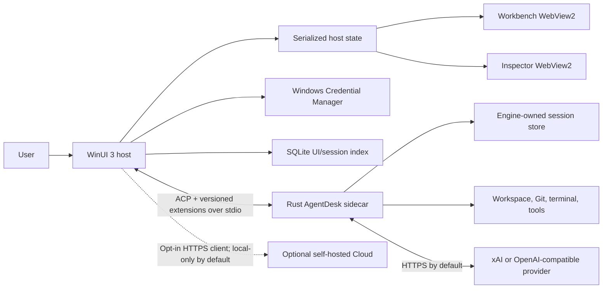

# AgentDesk Architecture

[English](ARCHITECTURE.md) | [简体中文](ARCHITECTURE.zh-CN.md)

## System Shape

AgentDesk keeps the Windows product shell separate from the inherited Rust agent runtime. The desktop owns Windows integration and projects engine events into UI state; the sidecar owns agent execution and durable engine sessions. They communicate through versioned ACP/JSON-RPC messages over redirected stdio rather than a private Rust library ABI.

## Desktop Layers

| Layer | Responsibility | Must not own |
| --- | --- | --- |
| `AgentDesk.App` | Window lifecycle, WebView2 hosting, bridge routing, permission UI, serialized state projection, Windows notifications, Cloud coordination, and experimental Windows UI Automation | Provider transport internals or durable engine transcripts |
| `AgentDesk.Core` | UI-independent contracts such as `IEngineClient`, capabilities, execution profiles, sessions, runtime tasks, and permission decisions | WinUI, WebView2, Credential Manager, or ACP serialization |
| `AgentDesk.Engine` | ACP client, NDJSON transport, sidecar command construction, native/WSL process lifecycle, protocol validation | XAML/Web rendering or secret persistence |
| `AgentDesk.Platform.Windows` | Credential Manager, SQLite index, local provider settings, Windows process integration | Agent execution policy or protocol semantics |
| `AgentDesk.Cloud.Client` | HTTPS API client, encrypted session envelopes, handoff, recovery-key pairing, rollback detection | Provider API keys, plaintext server storage, or remote execution isolation |
| `AgentDesk.Updater.Core` / `AgentDesk.Updater` | Signed-manifest verification, bounded download/extraction, Portable replacement and restart | MSIX servicing or unsigned update trust |
| `desktop/web` | React workbench and inspector, Markdown timeline, Monaco diff, xterm.js terminal, localized controls | Direct filesystem, credential, or process access |

The two WebView2 surfaces have separate roles: the workbench renders navigation, conversation, task controls, and settings; the inspector renders changes, terminal output, and plan details. Both use a versioned host-message contract. Web content cannot call the sidecar, filesystem, or Credential Manager directly.

## Startup And Session Flow

1. The host loads non-secret provider settings and retrieves the credential associated with the configured Base URL.
2. It starts the architecture-matched `agentdesk-engine.exe` or the WSL command with redirected stdin/stdout/stderr and process-tree ownership.
3. For desktop-managed credentials, the host calls the logical `agentdesk/v1/credential` extension before the standard ACP handshake. Failure aborts startup.
4. The host performs ACP `initialize` plus logical `agentdesk/v1/initialize` capability negotiation.
5. A strict execution request also calls logical `agentdesk/v1/health`. Missing or incomplete sandbox attestation stops the sidecar before authentication or session creation.
6. The host authenticates, creates or loads a session, then serializes notifications into the active session generation. Events from a stale process generation or inactive session are ignored.
7. WebView2 receives a UI projection, not raw engine authority. User commands return through the typed host bridge and are validated before engine calls.
8. Optional Cloud, backup, session-transfer, update, and notification operations are coordinated by the native host. Secret prompts and paths selected by native maintenance/Cloud file dialogs never cross into WebView2 as reusable authority.

Cancellation and window close terminate the owned sidecar process tree. A transport failure faults the active engine generation so a restarted sidecar cannot append events to stale UI state.

## Protocol Surface

The base workflow retains ACP initialize, authentication, session creation/load, prompt, cancel, mode change, tool updates, and permission requests. AgentDesk probes optional extensions and exposes a feature only when the engine response is valid. C# APIs and the Rust dispatcher use logical extension names such as `agentdesk/v1/health` and `x.ai/session/list`; the NDJSON transport writes the ACP-required underscore-prefixed wire methods, for example `_agentdesk/v1/health` and `_x.ai/session/list`.

Current extension families include:

- `agentdesk/v1/initialize`, `agentdesk/v1/credential`, and `agentdesk/v1/health` for desktop capability, credential, and execution attestation boundaries.
- `x.ai/session/list`, `x.ai/session/rename`, `x.ai/session/fork`, `x.ai/compact_conversation`, `x.ai/rewind/points`, and `x.ai/rewind/execute` for the session center and history operations.
- `x.ai/commands/list` and `x.ai/memory/flush` for runtime command discovery and explicit memory flush.
- `agentdesk/v1/memory/list`, `read`, `write`, and `delete` for bounded Memory file management. The engine advertises each operation separately; the desktop accepts mutation capabilities only when two-stage confirmation is mandatory, and WebView2 is limited to 512 descriptors and 64 KiB UTF-8 documents.
- `x.ai/task/list`, `x.ai/task/kill`, `x.ai/subagent/list_running`, `x.ai/subagent/get`, and `x.ai/subagent/cancel` for the active-session Runtime Dashboard. In strict mode, the desktop sidecar separately forces every subagent into a fail-closed isolated worktree; the Dashboard projects their paths, while full branch/conflict orchestration remains outside this list/detail/kill/cancel contract.
- `x.ai/git/worktree/create`, `list`, `show`, `apply`, `remove`, and `gc` for the manual worktree lifecycle. The host serializes these operations per workspace generation and exposes dry-run/destructive confirmation in the Web UI.
- MCP, Skills, Hooks, Plugins, and Marketplace list/action extensions for the settings catalog. The host projects bounded metadata, accepts environment-variable names instead of secret values, withholds Hook commands/URLs and Skill metadata from WebView2, and requires confirmation for code-loading mutations. In remote Cloud profiles, every Plugin mutation and Marketplace install/update/uninstall fails closed because each can rebuild or reload the registry; catalog list/refresh remains available. A publisher identifier supplied by WebView2 is never accepted as signature evidence.
- `agentdesk/v1/session/export` and `agentdesk/v1/session/import` for bounded session transfer used by local files, backup, and encrypted Cloud workflows.

Unknown, malformed, oversized, duplicated, or control-character-bearing extension data is rejected at the engine boundary. Capability absence should disable the corresponding UI instead of guessing support.

Strict subagent resume canonicalizes and validates a reused worktree when it is selected and again immediately before the tool context is created. This narrows the time-of-check/time-of-use window, but it cannot eliminate a malicious race by another process running as the same account. Git worktrees provide repository separation, not operating-system sandboxing.

## Host-Only Windows Automation

Windows UI Automation is not an ACP sidecar capability. The versioned bridge defines a bounded `windows/automation/execute` command that the WinUI host accepts, and Settings exposes its focus-window, invoke, and set-value controls. The host validates the process ID, action, selector, and size limits; applies the local opt-in and current team policy; serializes operations; and issues an allow-once permission request before calling the FlaUI/UIA3 executor. This bounded surface is not a claim that a general packaged Computer Use workflow is available.

The executor supports only three explicit operations: focus the target process's main window, invoke a control selected by Automation ID and/or name, and set a writable value on such a control. Completion events contain the action, process ID, and a bounded target identifier. They do not echo the entered value, and the inspector WebView2 does not receive these automation or permission events. Cancellation, denial, disposal, a busy executor, an invalid target, or an unsupported UIA pattern produces a bounded cancellation/error result.

This path is experimental. It attaches with the current Windows user's authority, has no operating-system isolation, does not discover or reason about arbitrary screen targets, and is not a production Computer Use sandbox.

## Cloud And Pairing Boundaries

The optional desktop Cloud path encrypts session documents, Runner task/result bodies, automation task bodies, and handoff content before sending them to the developer-preview server. The connected desktop workflow supports Runner register/queue/claim/complete, automation create/list/disable, and authenticated SignalR change notifications. The server still sees routing metadata such as team, device, Runner, capability, revision, time, and ciphertext size; no production Runner isolation or background/device push delivery is shipped.

Recovery-key pairing packages are passphrase-protected and selected through native dialogs. `PairingPackageFileStore` accepts only bounded absolute `.agentdesk-pairing` files, rejects alternate data streams, device namespaces, reserved device names, invalid segments, directories, and reparse points, validates opened-handle final paths, holds directory handles across access, and replaces an existing package through a write-through temporary handle plus atomic handle rename. These controls reduce path substitution and partial-write risk; they do not make an exposed pairing passphrase or recovery key harmless.

## Data Ownership

| Data | Owner and storage | Notes |
| --- | --- | --- |
| API key | Windows Credential Manager | Bound to provider Base URL; never written into JSON settings |
| Provider Base URL/model/options | `%LOCALAPPDATA%\AgentDesk` JSON settings | Non-secret; plaintext HTTP requires explicit opt-in |
| Session transcript/checkpoints | Rust engine session store | The engine is authoritative for session content and history |
| Session search/archive UI metadata | Desktop SQLite index | Archive is a reversible local UI state, not engine deletion |
| Web timeline/terminal/diff state | In-memory host/WebView2 projection | Rebuilt from current session events; not a second transcript authority |
| Workspace files and Git worktrees | User-selected filesystem paths | Modified with the authority of the selected execution profile |
| Cloud access token and recovery key | Windows Credential Manager | Scoped by endpoint/team/device; never returned to WebView2 or stored in JSON settings |
| Cloud profile and sync revisions | `%LOCALAPPDATA%\AgentDesk` JSON/SQLite state | Defaults to local-only; revisions are used to reject server rollback |
| Self-hosted cloud records | Separate cloud SQLite database | Used only after explicit remote-profile setup; session/handoff bodies are client-encrypted AES-GCM envelopes with authenticated metadata binding |
| Pairing package | User-selected `.agentdesk-pairing` file | Passphrase-protected, size-bounded, opened without following reparse points, final-path checked, and atomically replaced |
| Portable update trust and staged state | Pinned public key plus `%LOCALAPPDATA%\AgentDesk` update state | Both updater and application manifests/signatures are verified; MSIX is not replaced by this path |

Changing the provider Base URL invalidates credential reuse and requires a new key. The sidecar receives the key through private stdio into process memory and has credential-like environment variables removed before launch. This reduces accidental inheritance; it does not protect against a compromised process running as the same Windows user.

## Execution Profiles

`NativeProtected` is the stable protocol enum for **Native compatibility (not sandboxed)**. It provides approval routing, credential cleanup, application-data separation, and process-tree cleanup, but no filesystem or network confinement.

`WslStrict` is a fail-closed profile. Installer, installed-engine SHA-256/ELF verification, path conversion, and sidecar launch share one explicit non-Docker WSL distribution selection. Runtime executes only `/usr/local/bin/agentdesk-engine` and rejects missing, ambiguous, stale, non-executable, or architecture-incompatible payloads. The current engine still cannot attest complete child-process network enforcement across every helper, hook, plugin, PTY, and command path, so the desktop rejects the health handshake. Bundling or installing a Linux sidecar does not change that result.

See the [AgentDesk threat model](AGENTDESK-THREAT-MODEL.md) and [Installation](INSTALLATION.md) for user-facing consequences.

## Packaging Boundary

The Windows build produces architecture-specific self-contained Portable and MSIX inputs plus a separate single-file Portable updater. Before packaging, the native PE sidecar must match the requested machine architecture and reserve at least 8 MiB for its main-thread stack. CI pairs the package with a matching Linux WSL payload, embeds legal/source notices, generates SPDX and CycloneDX SBOMs, and creates SHA-256 companions. Branch MSIX files remain unsigned; tag publication fails if signing credentials are missing or the cryptographic signer does not match the package publisher. ARM64 configuration is not a substitute for successful ARM64 CI and real-device launch evidence.

The optional cloud server is intentionally a separate ASP.NET Core application. The desktop consumes it through `AgentDesk.Cloud.Client`; it is not linked into the WinUI process, remains disabled by default, and is not required for local sessions. Its developer-preview boundary is documented in [cloud/README.md](../cloud/README.md).
