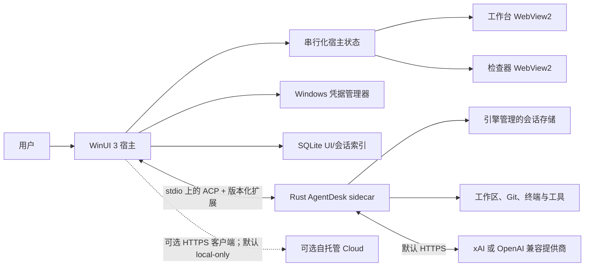

# AgentDesk 架构

[English](ARCHITECTURE.md) | [简体中文](ARCHITECTURE.zh-CN.md)

## 系统结构

AgentDesk 将 Windows 产品外壳与继承的 Rust 智能体运行时分离。桌面端负责 Windows 集成，并把引擎事件投影成 UI 状态；sidecar 负责智能体执行和持久化引擎会话。双方通过重定向 stdio 上带版本的 ACP/JSON-RPC 消息通信，不依赖 Rust 私有库 ABI。

## 桌面端分层

| 层 | 职责 | 不应负责 |
| --- | --- | --- |
| `AgentDesk.App` | 窗口生命周期、WebView2 承载、桥接路由、权限 UI、串行化状态投影、Windows 通知、Cloud 协调和实验性 Windows UI Automation | 提供商传输内部实现或持久化引擎转录 |
| `AgentDesk.Core` | 与 UI 无关的 `IEngineClient`、能力、执行配置、会话、运行时任务和权限决定等契约 | WinUI、WebView2、凭据管理器或 ACP 序列化 |
| `AgentDesk.Engine` | ACP 客户端、NDJSON 传输、sidecar 命令构建、本机/WSL 进程生命周期与协议验证 | XAML/Web 渲染或密钥持久化 |
| `AgentDesk.Platform.Windows` | 凭据管理器、SQLite 索引、本地提供商设置和 Windows 进程集成 | 智能体执行策略或协议语义 |
| `AgentDesk.Cloud.Client` | HTTPS API 客户端、加密会话 envelope、handoff、恢复密钥配对与回滚检测 | Provider API Key、服务器明文存储或远程执行隔离 |
| `AgentDesk.Updater.Core` / `AgentDesk.Updater` | 签名 manifest 验证、有界下载/解压、Portable 替换与重启 | MSIX 维护或未签名更新信任 |
| `desktop/web` | React 工作台与检查器、Markdown 时间线、Monaco diff、xterm.js 终端和本地化控件 | 直接访问文件系统、凭据或进程 |

两个 WebView2 界面职责独立：工作台渲染导航、会话、任务控件和设置；检查器渲染更改、终端输出和计划详情。二者都使用带版本的宿主消息契约。Web 内容不能直接调用 sidecar、文件系统或凭据管理器。

## 启动与会话流程

1. 宿主加载非敏感提供商设置，并读取与当前 Base URL 绑定的凭据。
2. 它使用重定向 stdin/stdout/stderr 和进程树所有权，启动架构匹配的 `agentdesk-engine.exe` 或 WSL 命令。
3. 使用桌面端管理的凭据时，宿主会在标准 ACP 握手前调用逻辑扩展名 `agentdesk/v1/credential`；失败会中止启动。
4. 宿主执行 ACP `initialize`，并通过逻辑扩展名 `agentdesk/v1/initialize` 协商能力。
5. 严格执行请求还会调用逻辑扩展名 `agentdesk/v1/health`。沙箱证明缺失或不完整时，会在认证或创建会话前停止 sidecar。
6. 宿主认证后创建或加载会话，再把通知串行投影到活动会话 generation。旧进程 generation 或非活动会话的事件会被忽略。
7. WebView2 接收的是 UI 投影，而不是原始引擎权限。用户命令经类型化宿主桥返回，并在引擎调用前完成验证。
8. 可选 Cloud、备份、会话迁移、更新和通知操作由原生宿主协调。Secret 输入以及原生维护/Cloud 文件对话框选择的路径不会以可复用权限的形式进入 WebView2。

取消和关闭窗口会终止宿主拥有的 sidecar 进程树。传输失败会使当前引擎 generation 进入故障状态，重启后的 sidecar 不能继续向旧 UI 状态追加事件。

## 协议表面

基础工作流保留 ACP 初始化、认证、创建/加载会话、提示词、取消、模式切换、工具更新和权限请求。AgentDesk 会探测可选扩展，并只在引擎响应有效时开放功能。C# API 与 Rust dispatcher 使用 `agentdesk/v1/health`、`x.ai/session/list` 这类逻辑扩展名；NDJSON 传输会写入 ACP 要求的下划线前缀线缆方法，例如 `_agentdesk/v1/health` 与 `_x.ai/session/list`。

当前扩展类别包括：

- `agentdesk/v1/initialize`、`agentdesk/v1/credential` 与 `agentdesk/v1/health`：桌面能力、凭据和执行证明边界。
- `x.ai/session/list`、`x.ai/session/rename`、`x.ai/session/fork`、`x.ai/compact_conversation`、`x.ai/rewind/points` 与 `x.ai/rewind/execute`：会话中心和历史操作。
- `x.ai/commands/list` 与 `x.ai/memory/flush`：运行时命令发现和显式 Memory flush。
- `agentdesk/v1/memory/list`、`read`、`write` 与 `delete`：有界 Memory 文件管理。引擎分别声明每个操作；只有两阶段确认被强制要求时，桌面端才接受修改能力；WebView2 最多接收 512 个描述符和 64 KiB UTF-8 正文。
- `x.ai/task/list`、`x.ai/task/kill`、`x.ai/subagent/list_running`、`x.ai/subagent/get` 与 `x.ai/subagent/cancel`：活动会话 Runtime Dashboard。在 strict 模式下，桌面 sidecar 会另外把所有 subagent 强制放入 fail-closed 隔离 worktree，Dashboard 投影其路径；完整分支/冲突编排不属于该列表/详情/kill/cancel 契约。
- `x.ai/git/worktree/create`、`list`、`show`、`apply`、`remove` 与 `gc`：手动 worktree 生命周期。宿主按工作区 generation 串行化这些操作，Web UI 提供 dry-run 与破坏性确认。
- MCP、Skills、Hooks、Plugins 与 Marketplace list/action 扩展：设置目录。宿主只投影有界元数据，以环境变量名代替 Secret 值，不向 WebView2 投影 Hook 命令/URL 与 Skill metadata，并要求确认加载代码的变更。远程 Cloud Profile 会对所有 Plugin 变更和 Marketplace install/update/uninstall fail-closed，因为这些操作都可能重建或重载注册表；目录列表/刷新仍可使用。WebView2 提供的发布者标识绝不会被当作签名证据。
- `agentdesk/v1/session/export` 与 `agentdesk/v1/session/import`：本地文件、备份和加密 Cloud 工作流使用的有界会话迁移。

引擎边界会拒绝未知、格式错误、超长、重复或带控制字符的扩展数据。缺少能力时应禁用对应 UI，不能猜测支持状态。

严格 subagent 恢复会在选择复用 worktree 时执行规范化与校验，并在创建工具上下文前立即再次校验。这会缩小检查与使用之间的竞态窗口，但无法消除同一账户下恶意进程制造的竞态。Git worktree 提供仓库级分离，不是操作系统沙箱。

## 仅由宿主执行的 Windows Automation

Windows UI Automation 不是 ACP sidecar 能力。版本化桥接定义了由 WinUI 宿主接收的有界 `windows/automation/execute` 命令，设置页已经提供聚焦窗口、调用控件和设置值入口。宿主负责校验进程 ID、动作、选择器和大小限制，应用本地显式启用与当前团队策略，串行化操作，并在调用 FlaUI/UIA3 执行器前发出“仅允许一次”权限请求。这个有界操作面不等于已经提供通用的打包后 Computer Use 工作流。

执行器只支持三个明确操作：聚焦目标进程主窗口；通过 Automation ID 和/或名称选择并调用控件；向这类控件设置可写值。完成事件只包含动作、进程 ID 和有界目标标识，不会回显输入值；检查器 WebView2 也不会收到这些自动化或权限事件。取消、拒绝、释放、执行器忙碌、目标无效或 UIA Pattern 不支持时，只会产生有界取消/错误结果。

该路径仍为实验性。它以当前 Windows 用户权限附加到目标进程，没有操作系统隔离，不会自主发现或推理任意屏幕目标，也不是生产级 Computer Use 沙箱。

## Cloud 与配对边界

可选桌面 Cloud 路径会在发送到开发预览 Server 前，加密会话文档、Runner 任务/结果正文、自动化任务正文和 handoff 内容。已接入桌面工作流包括 Runner 注册/入队/领取/完成、自动化创建/列表/停用，以及需认证的 SignalR 变更通知。Server 仍能看到团队、设备、Runner、能力、revision、时间和密文大小等路由元数据；当前不提供生产 Runner 隔离或后台/设备 Push 交付。

恢复密钥配对包受口令保护，并通过原生对话框选择。`PairingPackageFileStore` 只接受有界、绝对路径的 `.agentdesk-pairing` 文件，拒绝备用数据流、设备命名空间、保留设备名、无效路径段、目录和 reparse point，校验已打开句柄的 final path，在访问期间持有目录句柄，并通过 write-through 临时句柄与原子句柄重命名替换现有文件。这些控制降低路径替换和部分写入风险，但不能让泄露的配对口令或恢复密钥变得无害。

## 数据归属

| 数据 | 所有者与存储 | 说明 |
| --- | --- | --- |
| API Key | Windows 凭据管理器 | 与提供商 Base URL 绑定；不会写入 JSON 设置 |
| 提供商 Base URL/模型/选项 | `%LOCALAPPDATA%\AgentDesk` 下的 JSON 设置 | 非敏感；明文 HTTP 需要明确授权 |
| 会话转录与检查点 | Rust 引擎会话存储 | 引擎是会话正文与历史的权威来源 |
| 会话搜索/归档 UI 元数据 | 桌面 SQLite 索引 | 归档是可逆的本地 UI 状态，不会删除引擎会话 |
| Web 时间线/终端/diff 状态 | 内存中的宿主/WebView2 投影 | 从当前会话事件重建，不是第二个转录权威 |
| 工作区文件与 Git worktree | 用户选择的文件系统路径 | 使用所选执行配置的权限修改 |
| Cloud 访问 Token 与恢复密钥 | Windows 凭据管理器 | 按端点/团队/设备隔离；不会返回 WebView2 或写入 JSON 设置 |
| Cloud Profile 与同步 revision | `%LOCALAPPDATA%\AgentDesk` 下的 JSON/SQLite 状态 | 默认 local-only；revision 用于拒绝服务器回滚 |
| 自托管 Cloud 记录 | 独立 Cloud SQLite 数据库 | 仅在明确配置远程 Profile 后使用；会话/handoff 正文是客户端加密、带认证元数据绑定的 AES-GCM envelope |
| 配对包 | 用户选择的 `.agentdesk-pairing` 文件 | 受口令保护、大小受限、打开时不跟随 reparse point、校验 final path，并原子替换 |
| Portable 更新信任与暂存状态 | 固定公钥和 `%LOCALAPPDATA%\AgentDesk` 更新状态 | 同时验证更新器与应用 manifest/signature；此路径不会替换 MSIX |

修改提供商 Base URL 会使旧凭据不可复用，并要求重新输入 Key。sidecar 启动前会清理类似凭据的环境变量，随后仅通过私有 stdio 把 Key 放入进程内存。这可以减少意外继承，但无法抵御以同一 Windows 用户身份运行的已攻陷进程。

## 执行配置

`NativeProtected` 是保持稳定的本机兼容协议枚举，用户界面称为**本机兼容模式（非沙箱）**。它提供权限审批路由、凭据清理、应用数据分离和进程树清理，但不限制文件系统或网络。

`WslStrict` 是 fail-closed 配置。安装器、安装文件 SHA-256/ELF 校验、路径转换与 sidecar 启动会共享同一个显式的非 Docker WSL 发行版选择。运行时只执行 `/usr/local/bin/agentdesk-engine`，并拒绝缺失、有歧义、过期、不可执行或架构不匹配的 payload。当前引擎仍无法证明每个 helper、Hook、插件、PTY 和命令路径都受到完整的子进程网络限制，因此桌面端会拒绝 health 握手。随包附带或安装 Linux sidecar 不会改变此结果。

威胁边界见 [AgentDesk 威胁模型](AGENTDESK-THREAT-MODEL.zh-CN.md)，用户侧影响见[安装指南](INSTALLATION.zh-CN.md)。

## 打包边界

Windows 构建会生成按架构区分的自包含 Portable、MSIX 输入和独立单文件 Portable 更新器。打包前，本机 PE sidecar 必须匹配请求的机器架构，并为主线程预留至少 8 MiB 栈。CI 将其与匹配的 Linux WSL payload 配对，嵌入法律与源码说明，生成 SPDX/CycloneDX SBOM 和 SHA-256 文件。分支 MSIX 保持未签名；tag 缺少签名凭据，或密码学签名者与包 Publisher 不一致时，发布会失败。ARM64 配置不能替代成功的 ARM64 CI 与真实设备启动证据。

可选 Cloud Server 有意作为独立 ASP.NET Core 应用存在。桌面端通过 `AgentDesk.Cloud.Client` 使用它；它不会链接进 WinUI 进程，默认关闭，本地会话也不依赖它。开发预览边界见 [cloud/README.zh-CN.md](../cloud/README.zh-CN.md)。
